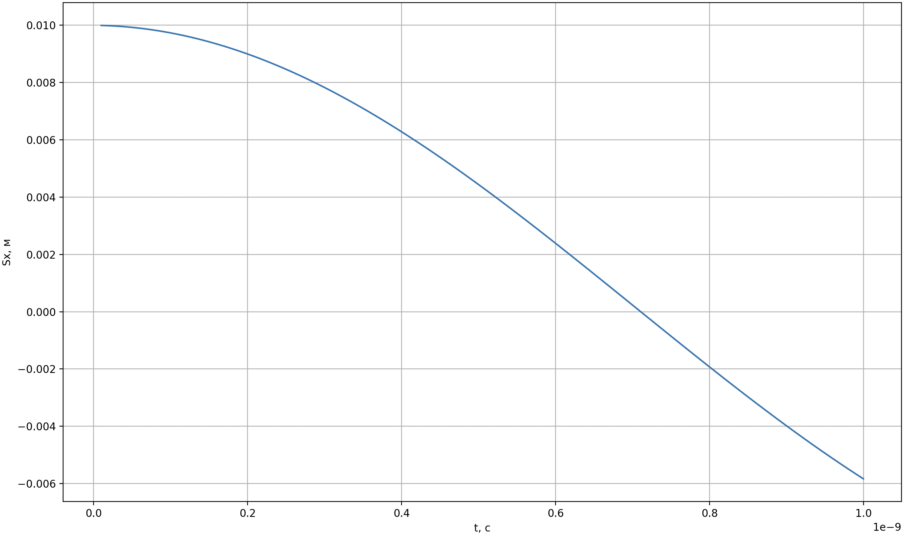
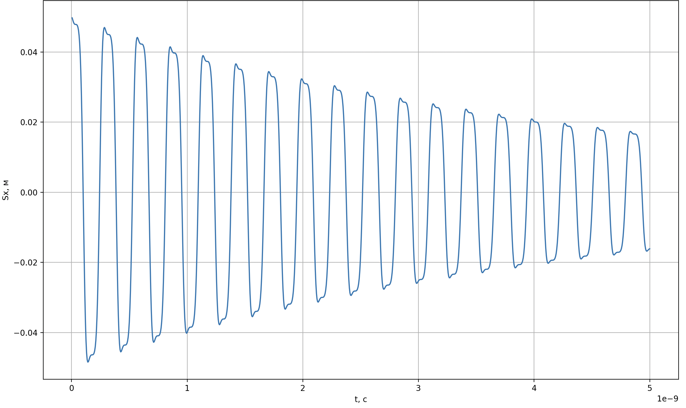

# Graphs

  

<em>Зависимость проекции вектора s на ось Ox от времени t в случае без приложения поля h.</em>

  

<em>Зависимость проекции вектора s на ось Ox от времени t в случае с приложением поля h, где h0 = H, ω = 2ω0.</em>

